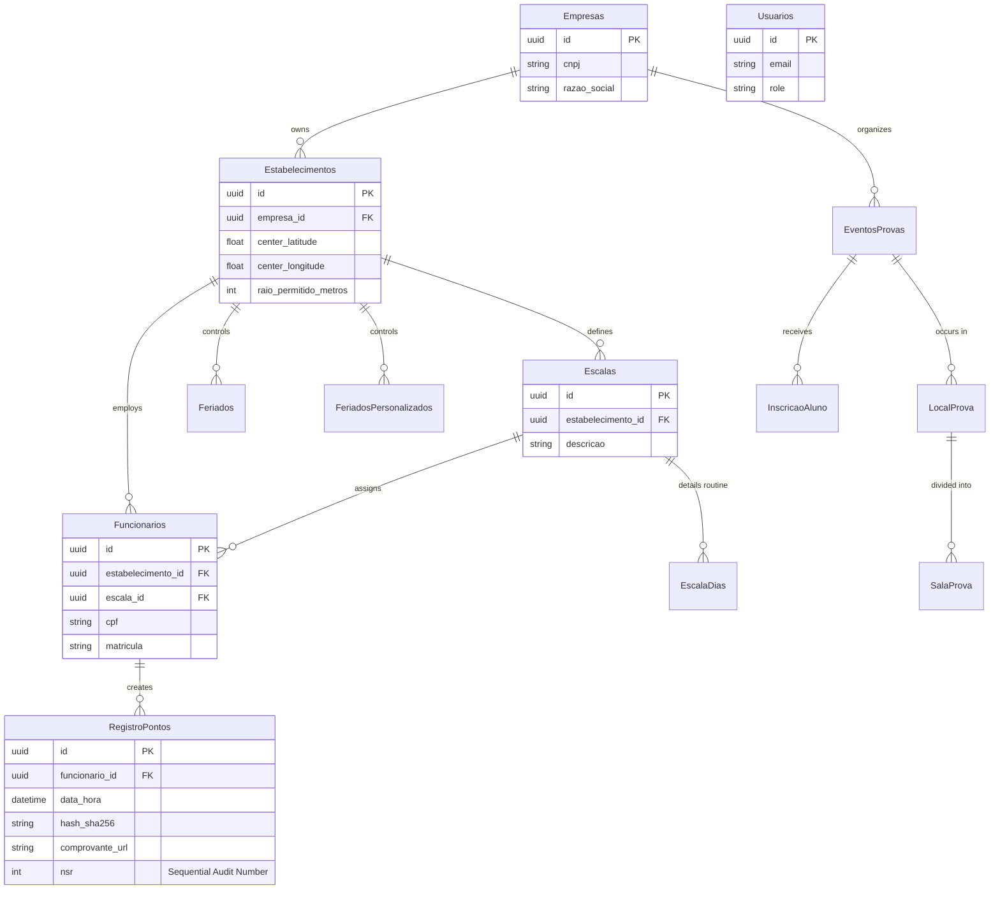

# ⏱️ EvoluaPonto - Enterprise Time Tracking & Compliance System (Architecture Showcase)

> **Disclaimer:** This repository serves as an architectural showcase. The full source code is proprietary. The diagrams, system design choices, and architectural patterns described here demonstrate my role as a software engineer in building this platform.

## 📌 Executive Summary
**EvoluaPonto** is a comprehensive, multi-tenant workforce management ecosystem. Designed to handle strict governmental labor regulations, the system ensures 100% data integrity through spatial validation (Geofencing), cryptographic hashing (SHA-256), digital signatures, and real-time auditing.

**My Role:** Co-Creator & Frontend/Backend Developer
**Core Stack:** C# .NET 8, PostgreSQL, React Native (Expo), Docker, Nginx.

---

## 🏗️ System Architecture & Domain Driven Design

The system follows a microservices-oriented approach, heavily relying on containerization to decouple business rules from delivery mechanisms.

### 1. Cryptographic Audit Trails & Sequential Compliance
To meet strict labor laws, the system must prove timestamps were not tampered with and maintain a continuous chronological ledger.
* **Implementation:** Every punch-in generates a unique SHA-256 hash and a strict Sequential Audit Number (NSR) isolated per tenant. Receipts are dynamically generated via `QuestPDF` and digitally signed utilizing the `BouncyCastle` cryptography library.
* **Export Engines:** Engineered complex data parsers capable of generating standardized flat files (AFD/AEJ) required by federal tax and labor audit systems.

### 2. Multi-Tenant Data Isolation (PostgreSQL RLS)
Beyond application-level Role-Based Access Control (RBAC) utilizing JWT Bearer Authentication, data isolation between different corporate clients (tenants) is enforced directly at the database engine level.
* **Implementation:** PostgreSQL Row Level Security (RLS) policies were implemented to guarantee that queries can never leak cross-tenant data, providing defense-in-depth even if the application layer is compromised.

### 3. Spatial Validation & Geofencing Engine
* **Logic:** When an employee registers a punch-in, the React Native mobile app calculates the exact coordinates. The .NET Backend processes the Haversine distance between the device's location and the allowed perimeter of the company's facility. Out-of-bounds requests are systematically blocked.

---

## 🗄️ Core Database Schema (Entity-Relationship)

---

## 🛠️ Technical Stack & Tooling

### Backend Services
* **Framework:** C# .NET 8.0 ASP.NET Core Web API
* **Database:** PostgreSQL 15 with Entity Framework Core 8.0
* **Cryptography & PDF:** BouncyCastle 2.6.2, QuestPDF 2025.7
* **Documentation:** Swagger/OpenAPI

### Mobile Client
* **Framework:** React Native 0.79 / Expo ~53.0
* **Routing & State:** Expo Router, Custom React Contexts (Auth, Badges, Notifications)
* **Maps:** React Native Maps for real-time geolocation validation.

### DevOps & Infrastructure
* **Containerization:** Fully Dockerized environments (Docker & Docker Compose).
* **Network:** Nginx configured as a reverse proxy.

---

## 🧠 Key Engineering Decisions & Challenges Solved

### The "Forgotten Punch-In" Challenge (Data Structure Optimization)
**Problem:** In workforce management, employees often forget to clock in, requiring HR to insert retroactive time-logs. In standard arrays, inserting data in the middle of a chronological timeline causes massive data shifting ( $O(n)$ overhead ).

**Solution:** The system's audit trail and history synchronization were architected to handle retroactive insertions smoothly, utilizing indexing and relational mapping that bypasses the need for contiguous memory reallocation, ensuring rapid data retrieval ( $O(1)$ ) for HR audits.

### Resilient Offline-First Synchronization
To handle adverse connectivity conditions, the React Native app is structured with decoupled services (`services/api.ts` and `services/storage.ts`). This ensures that a time-tracking request and its geolocation payload are safely cached locally and synchronized with the PostgreSQL database only when a stable connection is verified.

---

## 🚀 My Technical Contributions

As a core developer, I took full-stack ownership of critical business modules, engineering them from the PostgreSQL database schema up to the React Native mobile interfaces:

* **Retroactive Punch Approval Workflow:** Architected the complete state-machine for manual punch inclusions. Developed the C# REST endpoints and mobile screens that allow employees to request missed punches, track their status (Pending/Approved/Rejected), and provided administrators with a secure validation dashboard.
* **Time Mirror (Espelho de Ponto) & Dashboard:** Engineered the core employee home screen and monthly aggregation dashboard. Optimized the backend payload to compile chronological time-logs and calculate daily balances efficiently.
* **Digital Receipt Management:** Built the endpoints and mobile interfaces to fetch, list, and display the cryptographically signed PDF receipts, interfacing seamlessly with the application's object storage system.
* **Operational Domain Modules (Schedules & Holidays):** Designed and implemented the complete CRUD lifecycle for Work Schedules (Escalas) and Holidays. Handled complex date-time relational mapping in Entity Framework Core to ensure the system accurately identifies expected working hours and exceptions.
* **Employee Management System:** Developed the frontend forms and backend validation logic for employee onboarding and profile editing, ensuring robust state management in React Native and strict data integrity in the database.
